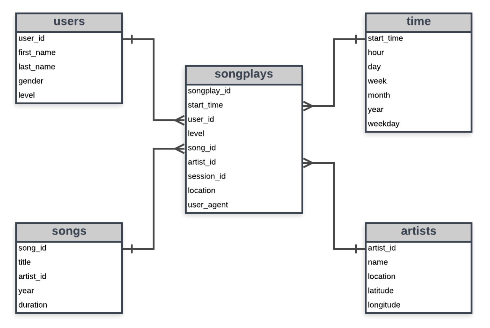

Summary:

The main goal of this project is to establish an ETL pipeline that 

1) Extracts songs, artists data from a given set of files. 
2) Analyses log data for song plays and 
3) Create a data model and store data that is optimized for sing play analysis.

The main parts of the project are
1) Schema: A star schema that contains 1 fact table and 4 dimension table.

    
    The dimension tables include
     - users
     - songs
     - artists
     - time
    
    The fact table songplays stores data that contains the the songs played by users including their location and how they played(browser etc.)
    The fact table may or may not contain the song and artist data given the heavy volume of the log data. If the logs contains song play from 
    a song that is in the dimenstion table the songplay table stores the details
    
 
 2) Queries:
    These are the SQL queries that are used to 
    
    - establish/create the above schema.
    - Insert data into the tables.
    - Query the songplay table
    
 3) ETL Pipeline:
    This is the python script used to extract the song, artist data from the json file. It also reads the log data to extract user and time 
    information from the logs and populates the user and time dimenstion tables.
    
    THe final step of the pipeline is to filter out songplay data and extract song, artist information from the dimension tables and store the
    Fact table record(optimizew for song play analysis) in the fact table.
    
    
 
 Example queries for singplay analysis:
 
 1) Most played artists in descending order ( if data avaialble):

 select count(*) as play_count, artist_id from songplays group by artist_id order by play_count desc

 2) Most played song:
 
  select count(*) as play_count, song_id from songplays group by song_id order by play_count desc

 3) Hour of the day when most songs are played:
 
  select t.hour as hour_of_day, count(*) as play_count
   from songplays s, time t where s.start_time = t.start_time 
   group by t.hour order by play_count desc
   
   